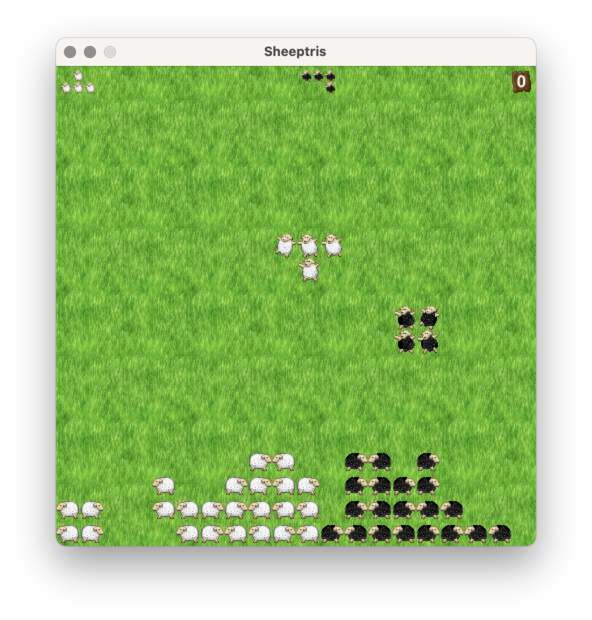

# Sheeptris

A multiplayer Tetris with sheeps.
Can be played by up to three players simultaneously.

## How to build and run the game

Just type

	$ make

to build and run the game in solo mode.

To run the game for two players, do

	$ make two

You know what to do for three players.

## Configuration

The keyboard layout of each player is defined in its corresponding
configuration file. See [res/players](res/players).
